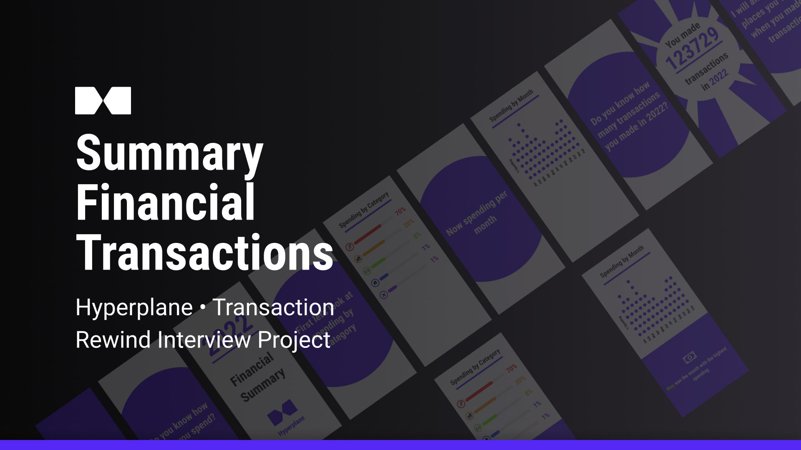

<style>
   .btn-default{
      all: unset;

      width: 100px;
      height: 20px;
      padding: 10px;
      border-radius: 9999px;

      background: #5628f5;
      color: #FFFFFF;
      font-weight: bold;

      cursor: pointer;
   }
   .btn-default:hover{
      background: #341893;
   }
   .btn-default:active{
      background: #27126e;
   }
</style>

# Summary Financial Transaction App



This is the design solution for the Hyperplane selection process interview.

This project aims to be a web application in which the user can visualize his banking activity during the year in a format similar to [Spotify Wrapped](https://youtu.be/Ca1etgVvyjg) or [Strava Year](https://youtu.be/R52KM9JZdbc) in Sport.

The application demo can be found at the [Application Demo](https://summary-financial-transctions-app.vercel.app/)

<a class="btn-default" href="https://summary-financial-transctions-app.vercel.app/" target="_blank">Application Demo</a>

## Design

For the design of this project, a Figma was initially created for UI/UX development.

The design can be found in the [Figma Design Project](https://www.figma.com/file/5qSDl6jYTLiAniQtb7mL0h/HyperPlane-%E2%80%A2-Transaction-Rewind-Interview-Project?type=design&node-id=2%3A12&mode=design&t=15nA0NymTvx9eTG7-1).

<a class="btn-default" href="https://www.figma.com/file/5qSDl6jYTLiAniQtb7mL0h/HyperPlane-%E2%80%A2-Transaction-Rewind-Interview-Project?type=design&node-id=2%3A12&mode=design&t=15nA0NymTvx9eTG7-1" target="_blank">Figma Design Project</a>


## Technologies

The main technologies for the front-end are:

* [ReactJS](https://pt-br.legacy.reactjs.org/)
* [Typescript](https://www.typescriptlang.org/)
* [Vite](https://vitejs.dev/guide/)

The main dependencies used are:

```json
"dependencies": {
   "react": "^18.2.0",
   "react-dom": "^18.2.0"
},
"devDependencies": {
   "@types/react": "^18.2.15",
   "@types/react-dom": "^18.2.7",
   "@typescript-eslint/eslint-plugin": "^6.0.0",
   "@typescript-eslint/parser": "^6.0.0",
   "@vitejs/plugin-react": "^4.0.3",
   "eslint": "^8.45.0",
   "eslint-plugin-react-hooks": "^4.6.0",
   "eslint-plugin-react-refresh": "^0.4.3",
   "typescript": "^5.0.2",
   "vite": "^4.4.5"
}
```

## Features

- [X] Create Screens
- [ ] Animation Between Screens
- [X] Icon Animation
- [X] Google Maps Integration
- [ ] Back-end Integration

## Run Project

Before running the project, install the dependencies:

```shell
npm i
```

To run the project, run the command:

```shell
npm run dev
```

## License

This project is open-source and is distributed under the MIT License. Feel free to explore, modify, and utilize the codebase according to the terms outlined in the license.
