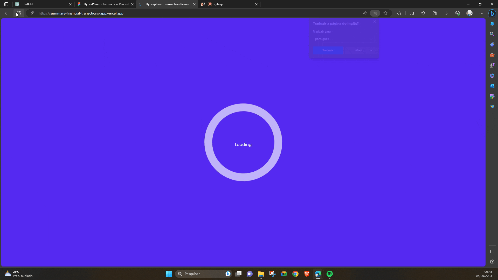

# Summary Financial Transaction App 📊


## About ℹ️

This is the design solution for the Hyperplane selection process interview.

This project aims to be a web application in which the user can visualize his banking activity during the year in a format similar to [Spotify Wrapped](https://youtu.be/Ca1etgVvyjg) or [Strava Year](https://youtu.be/R52KM9JZdbc) in Sport.

## Table of Content 📜
<!--ts-->
   * [About](#about-ℹ️)
   * [Table of Content](#table-of-content-📜)
   * [Design](#design-🎨)
   * [Application DEMO](#application-demo-🚀)
   * [Technologies](#technologies-⚙️)
   * [Features](#features-🚀)
   * [Run Project](#run-project-🏃)
   * [License](#license-📝)
<!--te-->


## Design 🎨

For the design of this project, a Figma was initially created for UI/UX development. 🖌️

The design can be found in the [Figma Design Project](https://www.figma.com/file/5qSDl6jYTLiAniQtb7mL0h/HyperPlane-%E2%80%A2-Transaction-Rewind-Interview-Project?type=design&node-id=2%3A12&mode=design&t=15nA0NymTvx9eTG7-1).🚀


## Application DEMO 🚀

The application demo can be found at the [Application Demo](https://summary-financial-transctions-app.vercel.app/) 🌐



## Technologies ⚙️

The main technologies for the front-end are:

* [ReactJS](https://pt-br.legacy.reactjs.org/)
* [Typescript](https://www.typescriptlang.org/)
* [Vite](https://vitejs.dev/guide/)

The main dependencies used are:

```json
"dependencies": {
  "@phosphor-icons/react": "^2.0.10",
  "@react-google-maps/api": "^2.19.2",
  "react": "^18.2.0",
  "react-dom": "^18.2.0",
  "react-particles": "^2.12.2",
  "react-router-dom": "^6.15.0",
  "react-spinners": "^0.13.8",
  "styled-components": "^6.0.7",
  "tsparticles-slim": "^2.12.0",
  "uuid": "^9.0.0"
},
"devDependencies": {
  "@rocketseat/eslint-config": "^2.1.0",
  "@tsparticles/slim": "^3.0.0-alpha.0",
  "@types/react": "^18.2.15",
  "@types/react-dom": "^18.2.7",
  "@types/uuid": "^9.0.2",
  "@typescript-eslint/eslint-plugin": "^6.0.0",
  "@typescript-eslint/parser": "^6.0.0",
  "@vitejs/plugin-react": "^4.0.3",
  "eslint": "^8.45.0",
  "eslint-plugin-react-hooks": "^4.6.0",
  "eslint-plugin-react-refresh": "^0.4.3",
  "typescript": "^5.0.2",
  "vite": "^4.4.5"
}
```

## Features 🚀

- [X] Create Screens
- [ ] Animation Between Screens
- [X] Icon Animation
- [X] Google Maps Integration
- [ ] Back-end Integration

## Run Project 🏃

Before running the project, viset the repositories:

* [summary-financial-transctions-api](https://github.com/Matheus1714/summary-financial-transctions-api)
* [financial-data-storage](https://github.com/Matheus1714/financial-data-storage)

Configure local or remote environments according to the documentation.

With the environments configured, install the dependencies:

```shell
npm i
```

To run the project, run the command:

```shell
npm run dev
```

## License 📝

This project is open-source and is distributed under the MIT License. Feel free to explore, modify, and utilize the codebase according to the terms outlined in the license.
